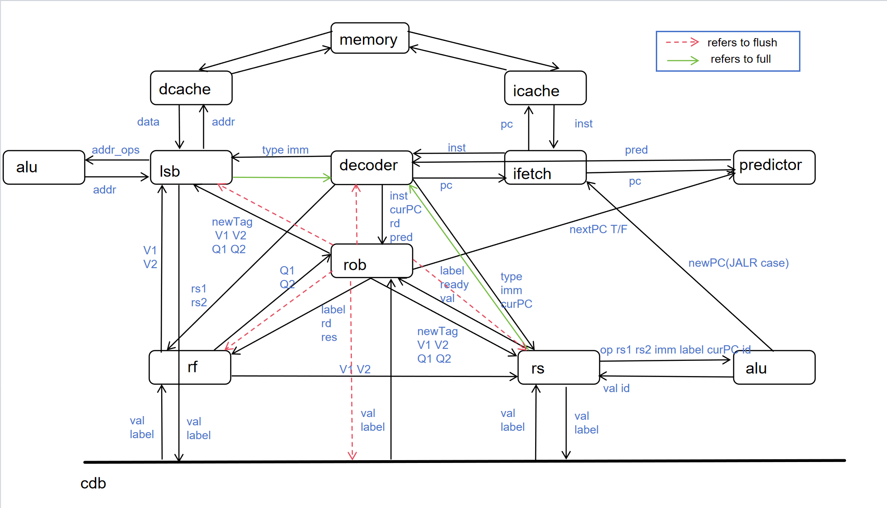
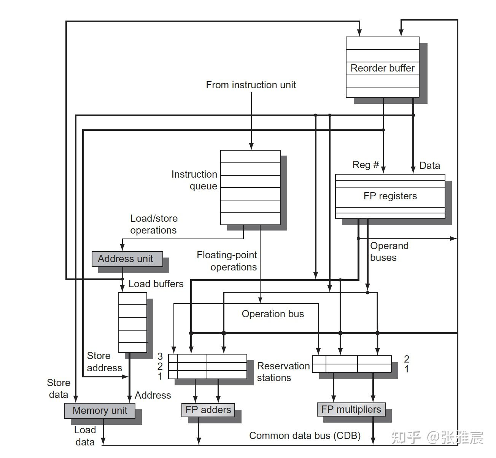

# RISCV-CPU

This project aims to accomplish CPU design supporting RISCV-32.

Here is the simple instruction: [CPU2024](https://github.com/ACMClassCourse-2023/CPU2024/)

For simulator, click here: [RISCV-Simulator](https://github.com/lzy001Yuki/RISCV-Simulator)

## About Overall Design

## Something deserved to be written down

Thanks for **stargazer**'s help in fpga environment configuration!!! :smile:

Here are some problems I have met:

## References:

[五级流水线CPU设计](https://notes.widcard.win/undergraduate/cs/report/)

[RISCV指令集](https://blog.csdn.net/qq_57502075/article/details/132015845)

[RV32C指令](https://blog.csdn.net/qq_38798111/article/details/129745919)

[Vivado教程](https://vlab.ustc.edu.cn/guide/doc_vivado.html)

### Tomasulo Outline

